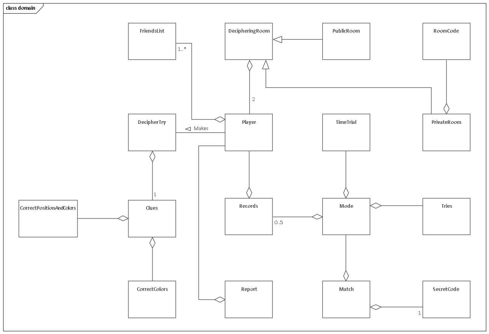
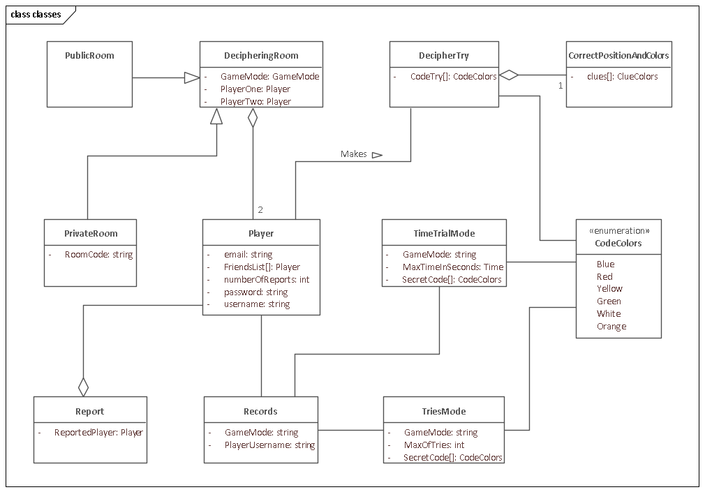

== Vista Estática

En el modelo de dominio se identifican los principales términos del dominio y se relacionan.

En la primera versión del modelo de clases se identificaron algunos atributos de las clases y se cambiaron los tipos de relación de otras.